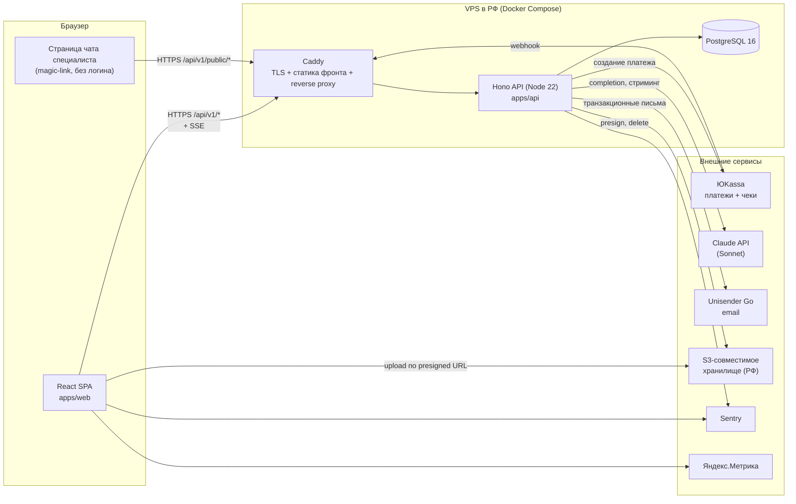

# 03 — Архитектура

## Компоненты системы



Ключевые решения (подробности в [adr/](adr/)):
- один VPS в РФ, всё в Docker Compose — [ADR-0001](adr/ADR-0001-single-vps-rf.md)
- специалист без аккаунта, доступ по magic-ссылке — [ADR-0002](adr/ADR-0002-magic-link-chat.md)
- платежи ЮKassa, выплаты вручную — [ADR-0003](adr/ADR-0003-yookassa-payments.md)
- единый AI-модуль поверх Claude API с лимитами — [ADR-0004](adr/ADR-0004-claude-ai-module.md)
- SSE вместо WebSocket для чата — [ADR-0005](adr/ADR-0005-sse-chat.md)
- единая модель Request для найма и консультаций — [ADR-0006](adr/ADR-0006-unified-request.md)
- стратегия soft-delete — [ADR-0007](adr/ADR-0007-soft-delete.md)

## Монорепозиторий

```
orbital/
├── apps/
│   ├── web/                  # React 19 + Vite + TS (существующий UI переезжает сюда)
│   │   ├── src/
│   │   │   ├── pages/        # экраны (существующие)
│   │   │   ├── components/   # переиспользуемые компоненты
│   │   │   ├── api/          # клиент API + хуки TanStack Query
│   │   │   ├── context/      # AuthContext
│   │   │   └── routes.tsx
│   │   └── package.json
│   └── api/                  # Hono + Node 22
│       ├── src/
│       │   ├── index.ts      # входная точка, сборка приложения
│       │   ├── routes/       # HTTP-слой: парсинг, валидация, коды ответов
│       │   ├── services/     # бизнес-логика, права, транзакции
│       │   ├── repositories/ # доступ к данным (Prisma)
│       │   ├── lib/          # ai/, payments/, email/, storage/, sse/, logger
│       │   └── middleware/   # auth, rate-limit, error-handler
│       ├── prisma/
│       │   ├── schema.prisma
│       │   ├── migrations/
│       │   └── seed.ts
│       ├── test/             # Vitest: юнит + интеграционные
│       └── package.json
├── packages/
│   └── shared/               # Zod-схемы и типы, общие для web и api
│       └── src/
│           ├── schemas/      # по домену: request.ts, specialist.ts, ...
│           └── types.ts
├── e2e/                      # Playwright
├── docs/                     # эта документация
├── docker-compose.yml        # локальная разработка (postgres, minio)
├── pnpm-workspace.yaml
└── package.json
```

## Слои бэкенда и правила зависимостей

```
routes → services → repositories → Prisma → PostgreSQL
            ↓
        lib/* (ai, payments, email, storage, sse)
```

| Слой | Отвечает за | Запрещено |
|------|-------------|-----------|
| `routes` | HTTP: парсинг, Zod-валидация входа/выхода, коды ответов | бизнес-логика, прямой Prisma |
| `services` | бизнес-логика, проверка прав (companyId!), транзакции, вызовы lib | знать про HTTP (Request/Response) |
| `repositories` | запросы к БД через Prisma, фильтр soft-delete | бизнес-решения, вызовы внешних API |
| `lib` | обёртки внешних сервисов, изолированные от домена | импортировать services/repositories |

Правило: зависимости только сверху вниз. `shared` импортируется всеми, не импортирует никого.

## Поток данных: от клика до строки в БД

Пример — владелец отправляет сообщение специалисту:

1. UI (`Messages.tsx`): `useMutation` из `apps/web/src/api/messages.ts` → `POST /api/v1/conversations/:id/messages`, тело валидируется Zod-схемой из `packages/shared`.
2. `routes/conversations.ts`: middleware auth достаёт сессию → `companyId`; Zod парсит тело.
3. `services/messages.service.ts`: проверяет, что диалог принадлежит компании; создаёт сообщение через репозиторий; если у специалиста нет активного magic-токена — создаёт и шлёт email через `lib/email`; публикует событие в `lib/sse`.
4. `repositories/messages.repo.ts`: `prisma.message.create`.
5. Ответ — созданное сообщение (Zod-схема ответа); TanStack Query инвалидирует ключ `['conversations', id]`.
6. Открытая вкладка специалиста получает сообщение через SSE-поток `GET /api/v1/public/chat/:token/events`.

## Внешние зависимости

| Сервис | Зачем | Модуль-обёртка |
|--------|------|----------------|
| Claude API (Sonnet) | все AI-функции | `lib/ai` |
| ЮKassa | платежи, чеки | `lib/payments` |
| Unisender Go | транзакционные письма | `lib/email` |
| S3 (РФ-провайдер) | резюме, аватары, бэкапы | `lib/storage` |
| Sentry | ошибки API и фронта | инициализация в entrypoint |
| Яндекс.Метрика | продуктовая аналитика фронта | скрипт в `index.html` |

Каждая обёртка в `lib/` имеет узкий интерфейс — замена провайдера (например, Unisender → другой)
не трогает services.
