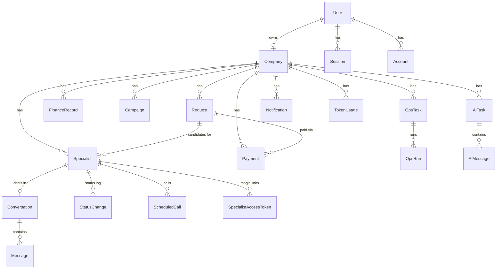

# 04 — Модель данных

## ERD



## Сущности

Общие правила: id — `cuid()`; `createdAt DateTime @default(now())`, `updatedAt @updatedAt` у всех
изменяемых сущностей (в таблицах ниже не повторяются); деньги — **копейки, Int**;
soft-delete — `deletedAt DateTime?` (NULL = живая запись).

### User / Session / Account / Verification
Таблицы Better Auth (генерируются его схемой). Дополняем `User.role`: `owner | admin`
(default `owner`). `User.emailVerified` — до `true` доступ к приложению закрыт (кроме экрана подтверждения).

### Company
| Колонка | Тип | Null | Default | Описание |
|---|---|---|---|---|
| id | String cuid | no | — | PK |
| ownerId | String | no | — | FK → User, `@unique` (1 владелец = 1 компания) |
| name | String | no | — | Название компании |
| deletedAt | DateTime | yes | NULL | soft-delete, окно восстановления 30 дней |

### Request — заявка (найм или консультация)
| Колонка | Тип | Null | Default | Описание |
|---|---|---|---|---|
| id | String cuid | no | — | PK |
| companyId | String | no | — | FK → Company |
| type | enum `hire\|consult` | no | — | Тип заявки |
| title | String | no | — | «Продуктовый дизайнер», «Консультация по налогам» |
| description | String | no | — | Свободный текст, используется AI для match |
| priceKopecks | Int | yes | NULL | Цена консультации; NULL для hire |
| status | enum `open\|in_progress\|done\|canceled` | no | open | Жизненный цикл заявки |
| deletedAt | DateTime | yes | NULL | soft-delete |

Индексы: `@@index([companyId, status])` — списки заявок компании.

### Specialist — специалист
| Колонка | Тип | Null | Default | Описание |
|---|---|---|---|---|
| id | String cuid | no | — | PK |
| companyId | String | no | — | FK → Company |
| requestId | String | no | — | FK → Request (одна заявка на специалиста) |
| name | String | no | — | ФИО |
| role | String | no | — | Роль/специализация |
| exp | String | yes | NULL | Опыт, как в UI («6 лет») |
| matchScore | Int | yes | NULL | AI-оценка 0–100 |
| matchReason | String | yes | NULL | Обоснование оценки от AI |
| location | String | yes | NULL | Город |
| salary | String | yes | NULL | Зарплата/ставка, свободный формат |
| source | String | yes | NULL | Откуда специалист |
| status | enum (ниже) | no | new | Статус воронки |
| skills | String[] | no | [] | Навыки |
| about | String | yes | NULL | О себе |
| email | String | no | — | Для magic-ссылки |
| phone | String | yes | NULL | Телефон |
| portfolioUrl | String | yes | NULL | Ссылка на портфолио |
| availability | String | yes | NULL | Доступность |
| timezone | String | yes | NULL | Часовой пояс |
| resumeKey | String | yes | NULL | Ключ PDF в S3 |
| avatarKey | String | yes | NULL | Ключ аватара в S3 |
| deletedAt | DateTime | yes | NULL | soft-delete |

`SpecialistStatus`: `new, contacted, scheduled, interviewed, hired, rejected, consult_scheduled, consult_done`.
Для `hire`-заявок используется подмножество `new…hired/rejected`, для `consult` —
`new, contacted, consult_scheduled, consult_done, rejected`. Валидация перехода — в сервисе.

Индексы: `@@index([companyId, status])` (фильтры списка), `@@index([requestId])` (специалисты заявки).

### StatusChange — лог статусов специалиста
| Колонка | Тип | Null | Описание |
|---|---|---|---|
| id | String cuid | no | PK |
| specialistId | String | no | FK → Specialist |
| fromStatus | enum | no | Было |
| toStatus | enum | no | Стало |
| createdAt | DateTime | no | Когда |

Индекс: `@@index([specialistId, createdAt])` — таймлайн профиля.

### SpecialistAccessToken — magic-ссылка
| Колонка | Тип | Null | Описание |
|---|---|---|---|
| id | String cuid | no | PK |
| specialistId | String | no | FK → Specialist |
| token | String | no | `@unique`, случайные 32 байта base64url |
| expiresAt | DateTime | no | +30 дней; каждое новое письмо создаёт новый токен |

### Conversation / Message
Conversation: `id`, `companyId`, `specialistId @unique` (один диалог на специалиста), `deletedAt`.

Message:
| Колонка | Тип | Null | Default | Описание |
|---|---|---|---|---|
| id | String cuid | no | — | PK |
| conversationId | String | no | — | FK → Conversation |
| sender | enum `owner\|specialist` | no | — | Кто написал |
| text | String | no | — | Текст |
| status | enum `sent\|delivered\|read` | no | sent | Прочтение владельцем/специалистом |

Индекс: `@@index([conversationId, createdAt])` — лента сообщений.

### ScheduledCall — звонок
| Колонка | Тип | Null | Default | Описание |
|---|---|---|---|---|
| id | String cuid | no | — | PK |
| companyId | String | no | — | FK → Company |
| specialistId | String | no | — | FK → Specialist |
| scheduledAt | DateTime | no | — | Дата и время |
| link | String | yes | NULL | Ссылка на видеовстречу |
| status | enum `scheduled\|canceled\|completed` | no | scheduled | |
| resultNote | String | yes | NULL | Итог консультации (FR-15) |

Индекс: `@@index([companyId, scheduledAt])` — предстоящие звонки.

### Payment — платёж за консультацию
| Колонка | Тип | Null | Default | Описание |
|---|---|---|---|---|
| id | String cuid | no | — | PK |
| companyId | String | no | — | FK → Company |
| requestId | String | no | — | FK → Request (type=consult) |
| specialistId | String | yes | NULL | FK → Specialist |
| amountKopecks | Int | no | — | Сумма |
| commissionPct | Int | no | — | Комиссия платформы на момент платежа, % |
| yookassaId | String | yes | NULL | `@unique`, id платежа в ЮKassa |
| status | enum `pending\|succeeded\|canceled\|refunded` | no | pending | Синхронизируется вебхуком |
| confirmationUrl | String | yes | NULL | Redirect-URL оплаты |
| paidAt | DateTime | yes | NULL | Когда оплачен |

Индекс: `@@index([companyId, createdAt])` — история платежей. Платежи не удаляются никогда.

### FinanceRecord — финансовая запись (hard delete)
| Колонка | Тип | Null | Описание |
|---|---|---|---|
| id | String cuid | no | PK |
| companyId | String | no | FK → Company |
| kind | enum `income\|expense` | no | Доход/расход |
| category | String | no | «Зарплаты», «Реклама»… |
| amountKopecks | Int | no | Сумма |
| period | DateTime | no | Первое число месяца, к которому относится |
| note | String? | yes | Комментарий |

Индекс: `@@index([companyId, period])` — графики по месяцам.

### Campaign — маркетинговая кампания (hard delete)
`id, companyId, name, channel, spendKopecks Int, impressions Int, clicks Int, conversions Int,
status enum active|paused|finished, periodStart DateTime, periodEnd DateTime`.
Индекс: `@@index([companyId, periodStart])`.

### OpsTask / OpsRun
OpsTask: `id, companyId, title, description?, schedule String? (текстовое описание расписания),
status enum idle|running|done|failed (default idle), lastRunAt?, deletedAt?`.
OpsRun: `id, opsTaskId, status enum running|done|failed, report String? (AI-отчёт), startedAt, finishedAt?`.
Индекс OpsRun: `@@index([opsTaskId, startedAt])`.

### AiTask / AiMessage — AI-диалоги
AiTask: `id, companyId, kind enum freeform|hiring|finance|marketing|operations, title` (первые
50 символов первого сообщения).
AiMessage: `id, aiTaskId, role enum user|assistant, content String, tokensIn Int @default(0),
tokensOut Int @default(0)`.
Индекс: `@@index([aiTaskId, createdAt])`.

### TokenUsage — лимит токенов
`id, companyId, month String ("2026-08"), tokensUsed Int @default(0)`, `@@unique([companyId, month])`.
Инкрементируется атомарно после каждого AI-вызова; проверка лимита перед вызовом.

### Notification
`id, companyId, type enum message|call|payment|system, text, link String? (роут в приложении),
readAt DateTime?`. Индекс: `@@index([companyId, readAt, createdAt])`.

### AnalyticsEvent
`id, companyId String?, name String, props Json @default("{}")`. Индекс: `@@index([name, createdAt])`.
Пишется сервисами (fire-and-forget), не удаляется.

## Каскады удаления

- `Company` hard-delete (по истечении 30 дней окна) → каскадом всё её содержимое (`onDelete: Cascade` на всех FK от Company).
- `Specialist` hard-delete не предусмотрен в приложении (только soft) — каскады: StatusChange, ScheduledCall, Conversation → Messages, SpecialistAccessToken (`Cascade`).
- `Request` soft-delete → сервис одновременно soft-delete'ит привязанных специалистов.
- `Payment.specialistId` — `onDelete: SetNull` (платёж живёт дольше записи специалиста).

## Prisma-схема (готова к копированию)

```prisma
generator client {
  provider = "prisma-client-js"
}

datasource db {
  provider = "postgresql"
  url      = env("DATABASE_URL")
}

// ─── Better Auth (сгенерировано `better-auth generate`, T-008) ───────────────
model User {
  id            String    @id
  name          String
  email         String
  emailVerified Boolean   @default(false)
  image         String?
  role          String    @default("owner") // owner | admin — наше расширение
  createdAt     DateTime  @default(now())
  updatedAt     DateTime  @updatedAt
  sessions      Session[]
  accounts      Account[]
  company       Company?

  @@unique([email])
  @@map("user")
}

model Session {
  id        String   @id
  expiresAt DateTime
  token     String
  createdAt DateTime @default(now())
  updatedAt DateTime @updatedAt
  ipAddress String?
  userAgent String?
  userId    String
  user      User     @relation(fields: [userId], references: [id], onDelete: Cascade)

  @@unique([token])
  @@index([userId])
  @@map("session")
}

model Account {
  id                    String    @id
  accountId             String
  providerId            String
  userId                String
  user                  User      @relation(fields: [userId], references: [id], onDelete: Cascade)
  accessToken           String?
  refreshToken          String?
  idToken               String?
  accessTokenExpiresAt  DateTime?
  refreshTokenExpiresAt DateTime?
  scope                 String?
  password              String?
  createdAt             DateTime  @default(now())
  updatedAt             DateTime  @updatedAt

  @@index([userId])
  @@map("account")
}

model Verification {
  id         String   @id
  identifier String
  value      String
  expiresAt  DateTime
  createdAt  DateTime @default(now())
  updatedAt  DateTime @updatedAt

  @@index([identifier])
  @@map("verification")
}

// ─── Домен ──────────────────────────────────────────────────────────────────
model Company {
  id        String    @id @default(cuid())
  ownerId   String    @unique
  name      String
  deletedAt DateTime?
  createdAt DateTime  @default(now())
  updatedAt DateTime  @updatedAt

  owner           User             @relation(fields: [ownerId], references: [id], onDelete: Cascade)
  requests        Request[]
  specialists     Specialist[]
  conversations   Conversation[]
  calls           ScheduledCall[]
  payments        Payment[]
  financeRecords  FinanceRecord[]
  campaigns       Campaign[]
  opsTasks        OpsTask[]
  aiTasks         AiTask[]
  notifications   Notification[]
  tokenUsages     TokenUsage[]
}

enum RequestType {
  hire
  consult
}

enum RequestStatus {
  open
  in_progress
  done
  canceled
}

model Request {
  id           String        @id @default(cuid())
  companyId    String
  type         RequestType
  title        String
  description  String
  priceKopecks Int?
  status       RequestStatus @default(open)
  deletedAt    DateTime?
  createdAt    DateTime      @default(now())
  updatedAt    DateTime      @updatedAt

  company     Company      @relation(fields: [companyId], references: [id], onDelete: Cascade)
  specialists Specialist[]
  payments    Payment[]

  @@index([companyId, status])
}

enum SpecialistStatus {
  new
  contacted
  scheduled
  interviewed
  hired
  rejected
  consult_scheduled
  consult_done
}

model Specialist {
  id           String           @id @default(cuid())
  companyId    String
  requestId    String
  name         String
  role         String
  exp          String?
  matchScore   Int?
  matchReason  String?
  location     String?
  salary       String?
  source       String?
  status       SpecialistStatus @default(new)
  skills       String[]         @default([])
  about        String?
  email        String
  phone        String?
  portfolioUrl String?
  availability String?
  timezone     String?
  resumeKey    String?
  avatarKey    String?
  deletedAt    DateTime?
  createdAt    DateTime         @default(now())
  updatedAt    DateTime         @updatedAt

  company       Company                 @relation(fields: [companyId], references: [id], onDelete: Cascade)
  request       Request                 @relation(fields: [requestId], references: [id], onDelete: Cascade)
  statusChanges StatusChange[]
  conversation  Conversation?
  calls         ScheduledCall[]
  accessTokens  SpecialistAccessToken[]
  payments      Payment[]

  @@index([companyId, status])
  @@index([requestId])
}

model StatusChange {
  id           String           @id @default(cuid())
  specialistId String
  fromStatus   SpecialistStatus
  toStatus     SpecialistStatus
  createdAt    DateTime         @default(now())

  specialist Specialist @relation(fields: [specialistId], references: [id], onDelete: Cascade)

  @@index([specialistId, createdAt])
}

model SpecialistAccessToken {
  id           String   @id @default(cuid())
  specialistId String
  token        String   @unique
  expiresAt    DateTime
  createdAt    DateTime @default(now())

  specialist Specialist @relation(fields: [specialistId], references: [id], onDelete: Cascade)
}

model Conversation {
  id           String    @id @default(cuid())
  companyId    String
  specialistId String    @unique
  deletedAt    DateTime?
  createdAt    DateTime  @default(now())
  updatedAt    DateTime  @updatedAt

  company    Company    @relation(fields: [companyId], references: [id], onDelete: Cascade)
  specialist Specialist @relation(fields: [specialistId], references: [id], onDelete: Cascade)
  messages   Message[]
}

enum MessageSender {
  owner
  specialist
}

enum MessageStatus {
  sent
  delivered
  read
}

model Message {
  id             String        @id @default(cuid())
  conversationId String
  sender         MessageSender
  text           String
  status         MessageStatus @default(sent)
  createdAt      DateTime      @default(now())

  conversation Conversation @relation(fields: [conversationId], references: [id], onDelete: Cascade)

  @@index([conversationId, createdAt])
}

enum CallStatus {
  scheduled
  canceled
  completed
}

model ScheduledCall {
  id           String     @id @default(cuid())
  companyId    String
  specialistId String
  scheduledAt  DateTime
  link         String?
  status       CallStatus @default(scheduled)
  resultNote   String?
  createdAt    DateTime   @default(now())
  updatedAt    DateTime   @updatedAt

  company    Company    @relation(fields: [companyId], references: [id], onDelete: Cascade)
  specialist Specialist @relation(fields: [specialistId], references: [id], onDelete: Cascade)

  @@index([companyId, scheduledAt])
}

enum PaymentStatus {
  pending
  succeeded
  canceled
  refunded
}

model Payment {
  id              String        @id @default(cuid())
  companyId       String
  requestId       String
  specialistId    String?
  amountKopecks   Int
  commissionPct   Int
  yookassaId      String?       @unique
  status          PaymentStatus @default(pending)
  confirmationUrl String?
  paidAt          DateTime?
  createdAt       DateTime      @default(now())
  updatedAt       DateTime      @updatedAt

  company    Company     @relation(fields: [companyId], references: [id], onDelete: Cascade)
  request    Request     @relation(fields: [requestId], references: [id], onDelete: Restrict)
  specialist Specialist? @relation(fields: [specialistId], references: [id], onDelete: SetNull)

  @@index([companyId, createdAt])
}

enum FinanceKind {
  income
  expense
}

model FinanceRecord {
  id            String      @id @default(cuid())
  companyId     String
  kind          FinanceKind
  category      String
  amountKopecks Int
  period        DateTime
  note          String?
  createdAt     DateTime    @default(now())
  updatedAt     DateTime    @updatedAt

  company Company @relation(fields: [companyId], references: [id], onDelete: Cascade)

  @@index([companyId, period])
}

enum CampaignStatus {
  active
  paused
  finished
}

model Campaign {
  id            String         @id @default(cuid())
  companyId     String
  name          String
  channel       String
  spendKopecks  Int            @default(0)
  impressions   Int            @default(0)
  clicks        Int            @default(0)
  conversions   Int            @default(0)
  status        CampaignStatus @default(active)
  periodStart   DateTime
  periodEnd     DateTime
  createdAt     DateTime       @default(now())
  updatedAt     DateTime       @updatedAt

  company Company @relation(fields: [companyId], references: [id], onDelete: Cascade)

  @@index([companyId, periodStart])
}

enum OpsStatus {
  idle
  running
  done
  failed
}

model OpsTask {
  id          String    @id @default(cuid())
  companyId   String
  title       String
  description String?
  schedule    String?
  status      OpsStatus @default(idle)
  lastRunAt   DateTime?
  deletedAt   DateTime?
  createdAt   DateTime  @default(now())
  updatedAt   DateTime  @updatedAt

  company Company  @relation(fields: [companyId], references: [id], onDelete: Cascade)
  runs    OpsRun[]
}

enum OpsRunStatus {
  running
  done
  failed
}

model OpsRun {
  id         String       @id @default(cuid())
  opsTaskId  String
  status     OpsRunStatus @default(running)
  report     String?
  startedAt  DateTime     @default(now())
  finishedAt DateTime?

  opsTask OpsTask @relation(fields: [opsTaskId], references: [id], onDelete: Cascade)

  @@index([opsTaskId, startedAt])
}

enum AiKind {
  freeform
  hiring
  finance
  marketing
  operations
}

model AiTask {
  id        String   @id @default(cuid())
  companyId String
  kind      AiKind
  title     String
  createdAt DateTime @default(now())
  updatedAt DateTime @updatedAt

  company  Company     @relation(fields: [companyId], references: [id], onDelete: Cascade)
  messages AiMessage[]

  @@index([companyId, createdAt])
}

enum AiRole {
  user
  assistant
}

model AiMessage {
  id        String   @id @default(cuid())
  aiTaskId  String
  role      AiRole
  content   String
  tokensIn  Int      @default(0)
  tokensOut Int      @default(0)
  createdAt DateTime @default(now())

  aiTask AiTask @relation(fields: [aiTaskId], references: [id], onDelete: Cascade)

  @@index([aiTaskId, createdAt])
}

model TokenUsage {
  id         String @id @default(cuid())
  companyId  String
  month      String
  tokensUsed Int    @default(0)

  company Company @relation(fields: [companyId], references: [id], onDelete: Cascade)

  @@unique([companyId, month])
}

enum NotificationType {
  message
  call
  payment
  system
}

model Notification {
  id        String           @id @default(cuid())
  companyId String
  type      NotificationType
  text      String
  link      String?
  readAt    DateTime?
  createdAt DateTime         @default(now())

  company Company @relation(fields: [companyId], references: [id], onDelete: Cascade)

  @@index([companyId, readAt, createdAt])
}

model AnalyticsEvent {
  id        String   @id @default(cuid())
  companyId String?
  name      String
  props     Json     @default("{}")
  createdAt DateTime @default(now())

  @@index([name, createdAt])
}
```

Better Auth-модели выше — точный вывод `better-auth generate` (better-auth 1.6.25, T-008), не
ручной черновик. При обновлении версии better-auth схему нужно перегенерировать и свериться заново.
